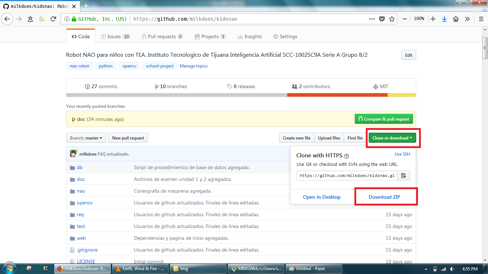

# Instrucciones para usar git
Primero descargar el zip del repositorio si no se puede clonar.


# Instalacion.
Si se utilizara las instalaciones automaticas, descargar PowerShell v2+ de
<https://www.microsoft.com/en-us/download/details.aspx?id=54616>\
Descargando el archivo llamado **W2K12-KB3191565-x64.msu** y siguiendo las
instrucciones.

## Chocolatey
Correr el script de instalacion de chocolatey localizado en
**kidsnao/req/chocolateyInstalacion.bat**

## Herramientas de software
Correr el script de instalacion de herramientas localizado en
**kidsnao/req/paquetesInstalacion.bat**

Esto instalara (por el momento) las herramientas de:
* python3
* python2
* git
* git-credential-manager (manejador de credenciales)

# Uso de git

## Clonacion
Cuando el script haya acabado de instalarse, hacer Shift+Click Derecho en
el folder donde se descargara el repositorio y seleccionar la opcion de
**git-bash**.

Al estar en la consola, usar el comando de
```sh
git clone https://github.com/milkdoes/kidsnao.git
```

Al haber clonado el repositorio, entrar en el folder clonado con
```sh
cd kidsnao/
```

Al estar en el repositorio, cambiar a la rama de prueba con
```sh
git branch test origin/test
git checkout test
git pull
```

Al estar dentro de la rama, crear un archivo con su nombre dentro del folder de
test. Esto con
```sh
cd test/
touch <ApellidoNombre.txt>
cd ..
```

Escribir dentro del archivo si asi se guste.

## Revisando que cambios hiciste
Se usa
```sh
git status -suall
```
para poder los nombres de los archivos nuevos creados. Si quieres ver tambien
texto, se usa (salir con **:q Enter**)
```sh
git diff HEAD
```

## Subiendo cambios
En general se realiza:
```sh
git add .
git commit -m "Mensaje de subida."
git push -u origin HEAD
```

Para subir los cambios. Por favor subir su nombre propio para confirmar el
tutorial basico de git.

# Extra
Para mas tutoriales y tips, acceder a las paginas de
* <https://rogerdudler.github.io/git-guide/index.es.html>
* <https://try.github.io/levels/1/challenges/1>
